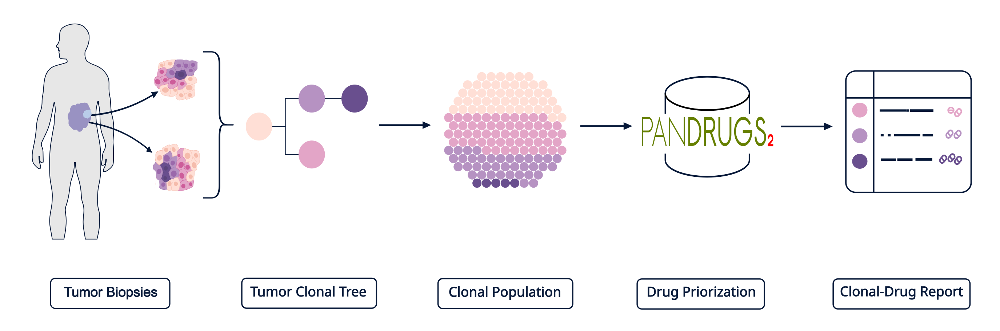
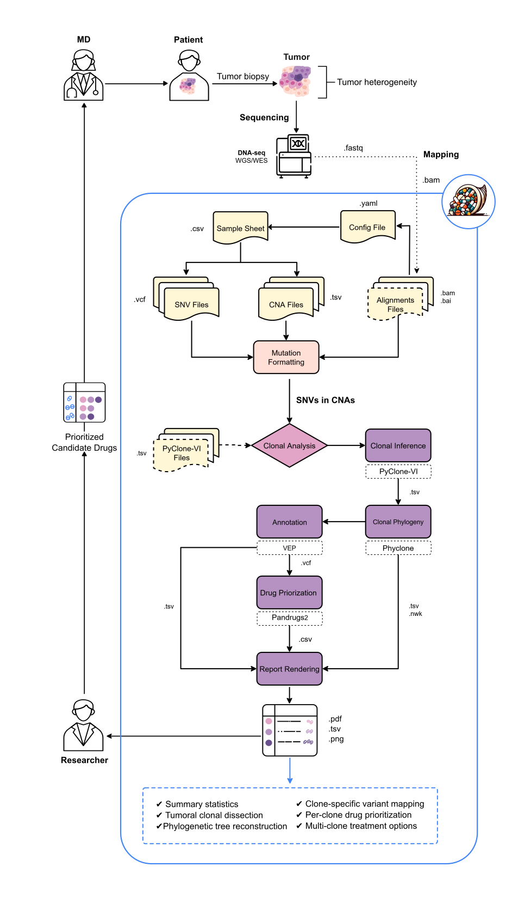

# Introduction

Cancer heterogeneity presents significant challenges in developing antitumoral effective treatments, as diverse clonal and subclonal populations can exhibit varied therapeutic responses. While advanced sequencing technologies enable detailed tumor genomic alterations characterization, translating subclonal inference analyses into clinical applications remains challenging. 

We present Clonucopya, a comprehensive snakemake workflow that bridges this gap by combining subclonal inference algorithms with in silico drug prioritization. Using whole-genome or whole-exome sequencing data, Clonucopya reconstructs clonal and subclonal evolutionary trees of tumor cells also identifying FDA/EMA approved and experimental candidate drugs targeting the specific genomic alterations within each population. The software offers easy configuration, detailed tables of prioritized drug response results associated with tumor clonality, clonality plots and intuitive reports integrating tumor heterogeneity and anticancer drug treatments. This integrated approach enables the design of therapeutic strategies that effectively target tumor clonality, guiding the selection of personalized therapies and providing an accessible tool that translates clonality data into actionable clinical insights for precision oncology.





# Workflow overview

Clonucopya is a snakemake workflow that combines the clonal inference of Pyclone-VI with the power of drug priorization from Pandrugs2.




# Main applications

* Propose potential therapeutic strategies based on clone-specific genomic alterations.
* Identify tumour clones and subclonal populations from SNVs and CNAs.
* Reconstruct tumour clonal architecture from single-sample, multi-region and longitudinal data.
* Characterize tumour evolution across space and time.
* Track clonal dynamics during progression, treatment and relapse.
* Detect resistant clones and evolutionary trajectories associated with therapeutic failure.
* Quantify genomic heterogeneity within and between tumour samples.
* Enable evolutionary-informed precision oncology analyses.


# Installation

```bash
# Clone Clonucopya repository
git clone https://github.com/cnio-bu/clonucopya.git

# Create a conda environment
conda create -n clonucopya

# Activate the environment
conda activate clonucopya

# Intall Required Packages
mamba install snakemake apptainer snakemake-executor-plugin-slurm
```

> [!IMPORTANT]
> Software versions are listed at the [environment files](https://github.com/cnio-bu/clonucopya/tree/main/workflow/envs). 
> This workflow has been tested with: [Python](https://www.python.org/downloads/release/python-3128/) v3.12.8, [Snakemake](https://snakemake.readthedocs.io/en/stable/) v9.20.0, [PyClone-VI](https://doi.org/10.1186/s12859-020-03919-2) v0.1.6, [PhyClone](https://doi.org/10.1093/bioinformatics/btaf344) v0.7.0, and [Ensembl VEP](https://link.springer.com/article/10.1186/s13059-016-0974-4) v113.3.

# Usage

## Full-Set mode

This execution mode uses all available workflow resources and options. It allows you to provide paired SNV and CNV calling files for each sample, along with the corresponding BAM files (optional) to enrich reference and alternative allele counts. This is particularly useful for samples lacking significant evidence of mutation at positions where mutations are detected in other samples. An indel filtering option is also included.

> The SNV and CNA calling files used as input for the full-set execution mode should be pre-filtered according to user-defined criteria or the established standards of the relevant research field.

### CNA Preprocessing

Due to the fact that there are many CNA callers, there are as many as output formats of called CNAs. So that, before running Clonucopya, you must make sure your CNAs has the propper format to use them as input. The expected format is a TSV file with the following columns:

1. Chrom: chromosome which contains the CNA, BED format (i.e chr1).
2. Start: start position of the CNA (integer).   
3. End: end position of the CNA (integer).
4. major_cn: major copy number of segment overlapping mutation (integer).
5. minor_cn: minor copy number of segment overlapping mutation (integer).
6. normal_cn: total copy number of segment in healthy tissue. For autosome this will be two and male sex chromosomes one (integer).


Example:

| Chrom 	| Start     	| End       	| major_cn 	| minor_cn 	| normal_cn 	|
|-------	|-----------	|-----------	|----------	|----------	|-----------	|
| chr1  	| 109367944 	| 109371874 	| 1        	| 0        	| 2         	|


> [!TIP]
> To facilitate this step, there are a couple of scripts at `workflow/scripts` to carry out this task for facets and ascat3 output.


### Configure workflow

Once the workflow has been downloaded, and the conda environment is ready, the parameters must be set.

* sampleshet: there is a samplesheet_template.csv available at config directory. The path to the samplesheet must be set in the config.yaml. 
* config.yaml: there is a config_template.yaml available at config directory. Please change the name to config.yaml or use the name you desire at workflow/Snakefile.
  - This workflow has two special parameters: `bam_check` (True|False) and `just_snv` (True|False). If BAM files are available for each sample, we recommend setting `bam_check` to True and providing the path to the directory containing the BAM files at `bam_files` parameter (leave empty otherwise). The `just_snv` parameter controls whether indels are filtered out or retained. It is set to True by default, which is the recommended configuration, as indel support remains an experimental feature.

> Generate your own seed for config.yaml. Manually chosen seeds may be too low-complexity and more stochastically dependent. Further, pseudorandom number generators from standard libraries of software like numpy in python (used in Pyclone-VI and Phyclone), often do not meet quality checks for randomness. To minimize seed bias, we instead recommend using the terminal to read four bytes from the operating system (/dev/random) to generate unpredictable 32-bit random seed values. For example, it can be easily generated on linux with this command `head -c 4 /dev/urandom | od -An -tu4`.

### Run Clonucopya

This workflow can be executed locally or in a cluster (best option).

- **Local run:**

```bash
# Go to workflow directory
cd workflow/

snakemake --software-deployment-method conda -j unlimited --cache
```


- **Cluster run:**

```bash
# Go to workflow directory
cd workflow/

sbatch -p long -e error.txt -c 8 --mem=32G -t1200 --wrap "snakemake --executor slurm --software-deployment-method conda -j unlimited --cache"
```

> [!NOTE]
> First successful execution will last over 7-8 hours. VEP's reference needs to be cached.


## Results
Clonucopya’s output is structured by `study` which is a group of biologically related samples that are analyzed together in Clonucopy. The experimental design and grouping criteria are defined according to specific research objectives, allowing multiple use cases adapted to the needs of the
comparative analysis (read [Main applications](#main-applications) section for futher details). The tree of files of the output is as it  follows:

```
{study}/
├── mutation_prep/
│   ├──{sample_id}_prep.mut.tsv
│   └──bam_checked/
│      └──{sample_id}_check.mut.tsv
├── pyclone-vi_prep/
│   ├── {sample_id}_intersect_pvi.tsv
│   └── combined_intersect_pvi.tsv
├── pyclone-vi/
│   ├── pvi_out.h5
│   └── pvi_out.tsv
├── phyclone/
│   ├── clusters.tsv
│   ├── trace.pkl.gz
│   ├── tree.nwk
│   └── tree_table.tsv
├── pvi_vep_prep
│   └── {study}_clone_*.tsv
├── vep_annotation/
│   ├── annotations/
│   │   └── {study}_clone_*.vcf
│   └── stats/ 
│       └── {study}_clone_*_summary.html
├── query_pandrugs/
│   └── clone_*/
│       ├── {study}_clone_*_computation.tsv
│       ├── {study}_clone_*_vscore.vcf
│       ├── {study}_clone_*_gene-drug.json
│       └── {study}_clone_*_gene-drug.csv
└── report/
    ├── {study}_report.pdf
    └── components/
        ├── clonal_tree.png
        ├── drug_prioritization.tsv
        ├── drug_summary.tsv
        ├── clonal_histogram.png
        ├── gene_alterations.tsv
        ├── report_panel.tsv
        ├── spheres_of_clones/
        │   └── {sample_id}_sphere_of_clones.png
        └── vaf_heatmaps/
            ├── complete/
            │   └── {sample_id}_complete_vaf_heatmap.png
            └── sampled/
                └── {sample_id}_sampled_vaf_heatmap.png
```

## Pyclone-VI Start mode

### Configure workflow

Once the workflow has been downloaded, and the conda environment is ready, the parameters must be set.

* pvi-start_samplesheet.csv: there is a pvi-start_samplesheet.csv available at config directory. The path to the samplesheet must be set in the config.yaml. 
* pvi-start_config.yaml: there is a pvi-start_config_template.yaml available at config directory. Please change the name to config.yaml or use the name you desire at workflow/Snakefile. 

> Generate your own seed for config.yaml as explained at [Full-Set mode](#full-set-mode) section. 

### Run Clonucopya

This workflow can be executed locally or in a cluster (best option).

- **Local run:**

```bash
# Go to workflow directory
cd workflow/

snakemake -s pvi-start --software-deployment-method conda -j unlimited --cache
```


- **Cluster run:**

```bash
# Go to workflow directory
cd workflow/

sbatch -p long -e error.txt -c 8 --mem=32G -t1200 --wrap "snakemake -s pvi-start --executor slurm --software-deployment-method conda -j unlimited --cache"
```

> First successful execution will last over 7-8 hours. VEP's reference needs to be cached.


## Results
Clonucopya’s output is structured by `study` which is a group of biologically related samples that are analyzed together in Clonucopy. The experimental design and grouping criteria are defined according to specific research objectives, allowing multiple use cases adapted to the needs of the
comparative analysis (read [Main applications](#main-applications) section for futher details). The tree of files of the output is as it  follows:

```
{study}/
├── pyclone-vi/
│   ├── pvi_out.h5
│   └── pvi_out.tsv
├── phyclone/
│   ├── clusters.tsv
│   ├── trace.pkl.gz
│   ├── tree.nwk
│   └── tree_table.tsv
├── pvi_vep_prep
│   └── {study}_clone_*.tsv
├── vep_annotation/
│   ├── annotations/
│   │   └── {study}_clone_*.vcf
│   └── stats/ 
│       └── {study}_clone_*_summary.html
├── query_pandrugs/
│   └── clone_*/
│       ├── {study}_clone_*_computation.tsv
│       ├── {study}_clone_*_vscore.vcf
│       ├── {study}_clone_*_gene-drug.json
│       └── {study}_clone_*_gene-drug.csv
└── report/
    ├── {study}_report.pdf
    └── components/
        ├── clonal_tree.png
        ├── clonal_histogram.png
        ├── drug_prioritization_wf2.tsv
        ├── drug_summary_wf2.tsv
        ├── gene_alterations_wf2.tsv
        ├── report_panel.tsv
        ├── spheres_of_clones/
        │   └── {sample_id}_sphere_of_clones.png
        └── vaf_heatmaps/
            ├── complete/
            │   └── {sample_id}_complete_vaf_heatmap.png
            └── sampled/
                └── {sample_id}_sampled_vaf_heatmap.png
```


>[!WARNING]
> Clonucopya is set to run full-set mode by default unless you specify the option `-s pvi-start` in the snakemake commnand.
> Be carefull with the name of the config and samplesheet file. Remove the suffix '_template' or change the name at the snakefile pvi-start or Snakefile (full-set mode). 


# Authors

* Guillermo Sánchez-Cid
* Carlos León-Ramos
* Gonzalo Gómez-López
* Fátima Al-Shahrour


# Support

1. If you have any questions regarding the use of Clonucopya, feel free to submit an [issue](https://github.com/cnio-bu/clonucopya/issues).
2. Clonucopya Frequently Asked Questions (FAQs) is available [here](https://github.com/cnio-bu/clonucopya/tree/main/FAQs).

