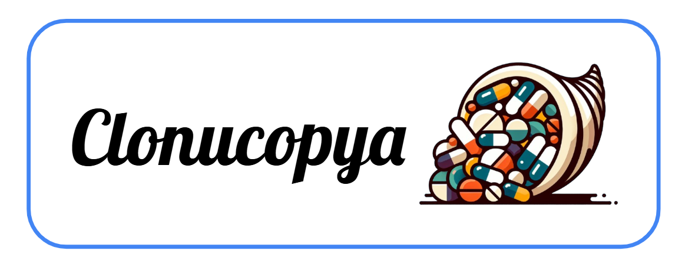
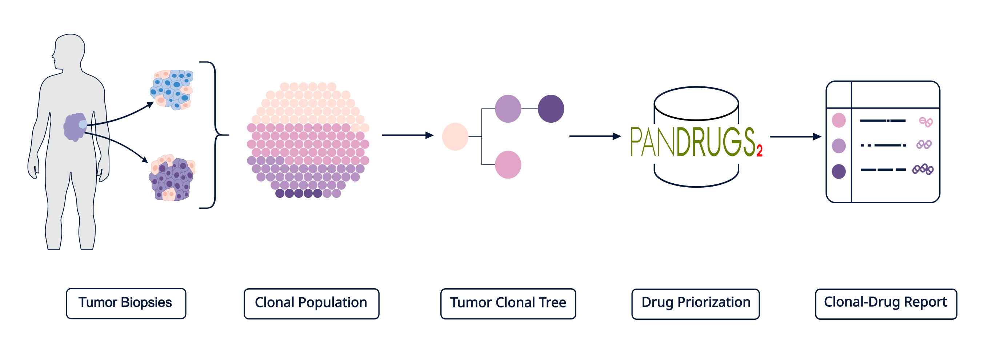
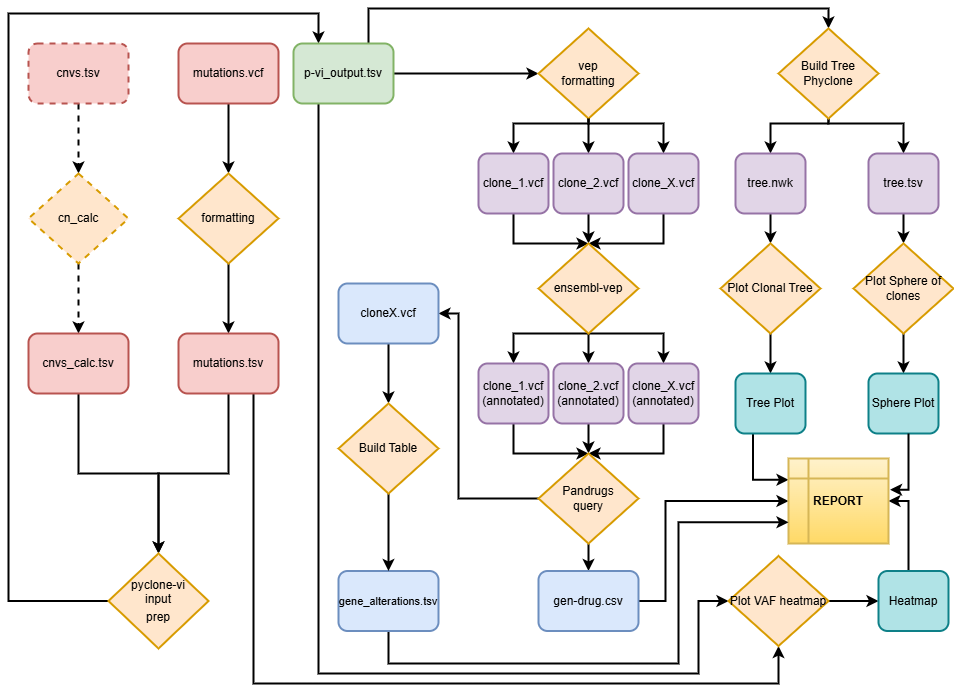

## Introduction

Cancer heterogeneity presents significant challenges in developing effective treatments, as diverse subclonal populations can exhibit varied therapeutic responses. While advanced sequencing technologies enable detailed tumor characterization, translating subclonal inference analyses into clinical applications remains challenging. Here we present Clonucopya, a comprehensive workflow that bridges this gap by combining subclonal inference algorithms with automated drug recommendation. Using whole-genome or whole-exome sequencing data, Clonucopya reconstructs clonal and subclonal evolutionary trees of tumor cells also identifying FDA/EMA-approved drugs targeting the specific genomic alterations within each population. The software offers easy configuration, detailed tables, clear visualizations and intuitive reports. This integrated approach enables the design of therapeutic strategies that tries to address the most of  tumor cells subpopulations,  guiding the selection of personalized treatments. This tool provides an accessible tool that transforms complex subclonal data into actionable clinical insights for personalized cancer treatment.



## Workflow overview

Clonucopya is a snakemake workflow that combines the clone inference of Pyclone-VI with the power of drug discovery from Pandrugs.




## Main applications

* Parent tumor and its metastases
* Sections in the same region of the tumor at different timepoints
* Sections of different regions of the tumor (1 or more timepoints).

## Instalation:

```bash
# Clone Clonucopya repository
git clone https://github.com/guillermoscb/clonucopya.git

# Create a conda environment
conda create -n clonucopya

# Activate the environment
conda activate clonucopya

# Intall Required Packages
mamba install snakemake apptainer snakemake-executor-plugin-slurm
```

## Usage

### Configure workflow

Once the workflow has been downloaded, and the conda enviroment is ready, the parameters must be set.

* sampleshet: there is a samplesheet_template.csv available at config directory. (The path to the samplesheet must be set in the config.yaml). 
* config.yaml: there is a config_template.yaml available at config directory. Please change the name to config.yaml or use the name you desire at workflow/Snakefile. 


### Run Clonucopya

This workflow can be executed locally or in a cluster (best option).

- **Local run:**

```bash
snakemake --software-deployment-method conda -j unlimited --cache
```


- **Cluster run:**

```bash
snakemake --executor slurm --software-deployment-method conda -j unlimited --cache
```

> First successful execution will last over 7-8 hours. VEP's reference needs to be cached. The following runs will be fully executed in a matter of 10-20 minutes on average.


## Results


## Authors

* Guillermo Sánchez-Cid
* Gonzalo Gómez-López
* Carlos León-Ramos
* Fátima Al-Shahrour
